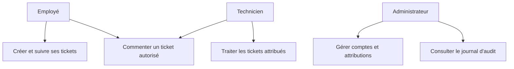
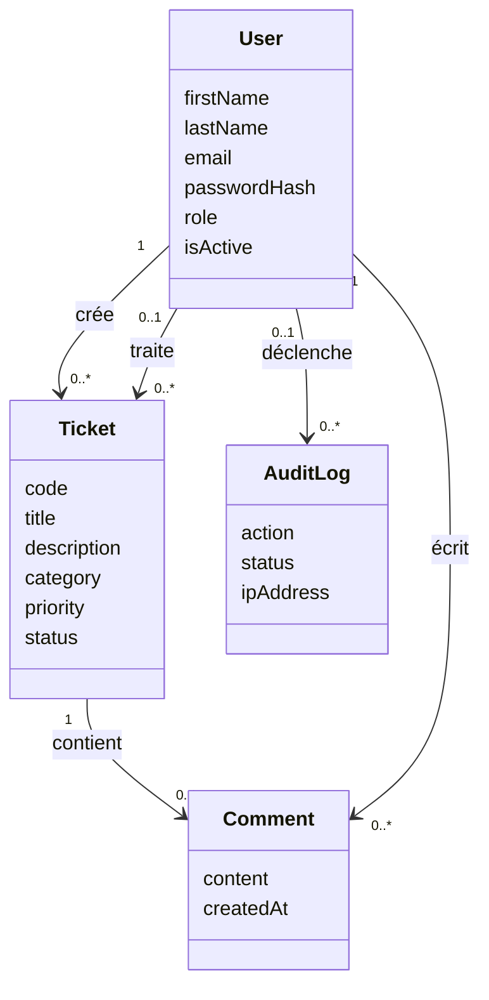
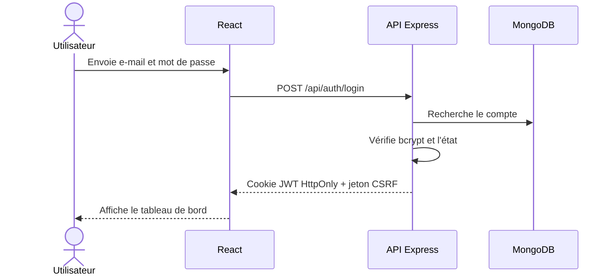
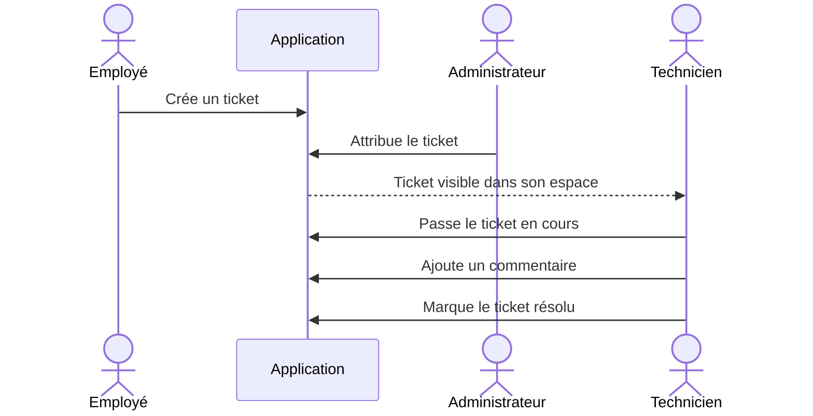

# Conception UML

## Cas d’utilisation

```mermaid
flowchart TB
  E[Employé] --> C[Créer et suivre ses tickets]
  T[Technicien] --> R[Traiter les tickets attribués]
  A[Administrateur] --> G[Gérer comptes et attributions]
  E --> M[Commenter un ticket autorisé]
  T --> M
  A --> J[Consulter le journal d'audit]
```

## Diagramme de classes

```mermaid
classDiagram
  class User {
    firstName
    lastName
    email
    passwordHash
    role
    isActive
  }
  class Ticket {
    code
    title
    description
    category
    priority
    status
  }
  class Comment {
    content
    createdAt
  }
  class AuditLog {
    action
    status
    ipAddress
  }
  User "1" --> "0..*" Ticket : crée
  User "0..1" --> "0..*" Ticket : traite
  Ticket "1" --> "0..*" Comment : contient
  User "1" --> "0..*" Comment : écrit
  User "0..1" --> "0..*" AuditLog : déclenche
```

## Séquence de connexion

```mermaid
sequenceDiagram
  actor U as Utilisateur
  participant W as React
  participant A as API Express
  participant D as MongoDB
  U->>W: Envoie e-mail et mot de passe
  W->>A: POST /api/auth/login
  A->>D: Recherche le compte
  A->>A: Vérifie bcrypt et l'état
  A-->>W: Cookie JWT HttpOnly + jeton CSRF
  W-->>U: Affiche le tableau de bord
```

## Séquence de traitement d’un ticket

```mermaid
sequenceDiagram
  actor E as Employé
  participant A as Application
  actor D as Administrateur
  actor T as Technicien
  E->>A: Crée un ticket
  D->>A: Attribue le ticket
  A-->>T: Ticket visible dans son espace
  T->>A: Passe le ticket en cours
  T->>A: Ajoute un commentaire
  T->>A: Marque le ticket résolu
```

